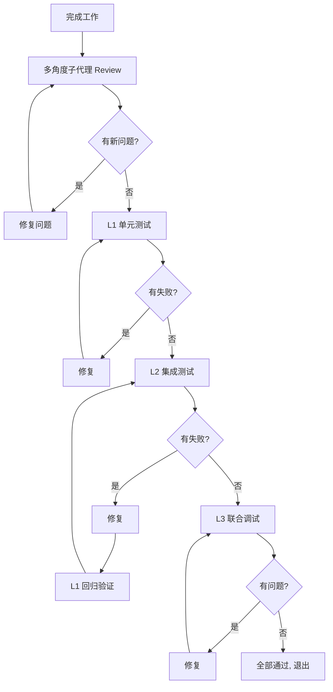

# CLAUDE.md

行为规范，旨在减少常见的 LLM 编码失误。可根据项目具体情况合并补充。

**权衡：** 本规范偏向谨慎，速度次之。对于简单任务，请自行判断。

## 1. 先思考，再动手

**不要假设。不要掩盖困惑。亮出取舍。**

实现之前：

- 明确说出你的假设。不确定就问。
- 存在多种理解时，都列出来——不要默默替用户做决定。
- 如果有更简单的做法，说出来。必要时敢于反驳。
- 遇到不清楚的地方，停下来，说清楚困惑在哪，然后问。

## 2. 简单优先

**用最少的代码解决问题。不做猜测性的设计。**

- 不添加需求之外的功能。
- 不为单次使用的代码写抽象。
- 不做未被要求的"灵活性"或"可配置性"。
- 不为不可能出现的场景做错误处理。
- 如果 200 行能写成 50 行，就重写。

自问："资深工程师会觉得这过于复杂吗？"如果是，就简化。

## 3. 手术刀式的改动

**只碰必须改的地方。只清理自己留下的垃圾。**

编辑已有代码时：

- 不要"顺手优化"相邻代码、注释或格式。
- 不要重构没坏的东西。
- 沿用既有风格，即使你有不同偏好。
- 发现无关的死代码，提一句——不要删。

你的变更产生孤儿时：

- 移除因**你的变更**而不再被使用的 import、变量、函数。
- 不清理之前就存在的死代码，除非被要求。

检验标准：每一行改动都能追溯到用户的需求。

## 4. 目标驱动

**定义成功标准。循环直到验证通过。**

将任务转化为可验证的目标：

- "加校验" → "编写非法输入的测试，然后让它通过"
- "修 Bug" → "写一个复现测试，然后修复"
- "重构 X" → "确保重构前后测试均通过"

多步骤任务，先简述计划：

```
1. [步骤] → 验证：[检查项]
2. [步骤] → 验证：[检查项]
3. [步骤] → 验证：[检查项]
```

清晰的成功标准让你能独立闭环。模糊的标准（"能跑就行"）需要反复澄清。

---

**这些规范生效的标志：** diff 中没有多余变更、没有因过度设计而重写、问题在实现前被澄清而非事后返工。

## 5. 提交规范

**格式：** `<type>(<scope>): <subject>`

`<type>` 类型：

| 类型       | 说明                         |
| ---------- | ---------------------------- |
| `feat`     | 新功能                       |
| `fix`      | 修复 Bug                     |
| `docs`     | 仅文档变更                   |
| `style`    | 代码格式，不影响逻辑         |
| `refactor` | 重构，非新功能非 Bug 修复    |
| `test`     | 新增或修改测试               |
| `chore`    | 构建、工具链、配置等         |
| `ci`       | CI/CD 配置变更               |

`<scope>` 可选，标识影响范围（模块、组件、包名等）。

`<subject>` 规则：

- 使用简体中文，祈使句语气（"添加"、"修复"、"移除"）
- 不超过 72 字符
- 句末不加句号
- 不以大写开头（除非专有名词）

`<body>` 和 `<footer>` 规则：

- 变更较大时（影响多个模块或行为有实质变化），必须写 body
- body 说明"做了什么"、"为什么这么做"、"有什么副作用"
- breaking change 必须在 footer 中以 `BREAKING CHANGE:` 开头写明
- 关联 issue 在 footer 中用 `Refs: #123` 标注

示例：

```
feat(auth): 添加 JWT 刷新令牌机制

在登录响应中返回 refreshToken，前端自动在 token 过期前刷新。
BREAKING CHANGE: 登录接口响应格式增加 refreshToken 字段
Refs: #42
```

## 6. 三级测试标准

所有代码变更必须经过三级测试验证，逐级推进：

### L1 — 单元测试

- 验证单个函数/方法的输入输出和边界条件
- 每个公开函数至少覆盖：正常路径、空输入、异常输入
- 使用项目内置测试框架运行

### L2 — 集合测试（集成测试）

- 使用本地 环境启动真实依赖（数据库）
- 验证模块间协作、外部依赖交互、端到端数据流
- db文件必须在本轮测试结束后清理

### L3 — 联合调试（前端 E2E）

- 通过 chrome-mcp 工具启动真实浏览器访问前端
- 验证用户可见的完整工作流
- 检查 UI 渲染、交互响应、网络请求

## 7. 自循环验证机制

**每项工作完成后，必须经过自循环验证才能视为完成。** 所有循环阶段都必须配合 TodoWrite 工具追踪进度。

### 完整流程



### 各阶段要求

**子代理 Review：**

- 至少启动 2 个不同角度的子代理（如：架构视角、安全视角、性能视角）
- 每个子代理的发现和修复建议必须记录到 todo 列表
- 每轮 review + 修复后重新发起下一轮，直到所有子代理报告无新问题
- TodoWrite 状态流转：`in_progress` → 发现问题 → 新建修复 todo → 完成 → 重新 review

**L1 单元测试：**

- TodoWrite 为每个测试用例创建独立 todo 项
- 失败的测试必须修复后重新运行，直到全部通过
- 新增代码必须补充对应的单元测试

**L2 集成测试：**

- L2 失败时必须同时回退验证 L1，确保单元测试不因修复而破坏
- TodoWrite 追踪：sqlite准备 → 测试用例 → 清理
- sqlite在测试结束后必须清理

**L3 联合调试：**

- 通过 chrome-mcp 工具执行真实浏览器测试
- 每个用户工作流必须至少有一个 L3 测试覆盖
- 发现的问题必须写入 todo，修复后重新验证完整流程

### 循环退出条件

- 所有测试级别（L1/L2/L3）全部通过
- 所有子代理 report 无新问题
- TodoWrite 中无 `pending` 或 `in_progress` 状态的 todo
- 任何一级失败且无法修复时，停止循环并报告阻塞原因

---

**这些规范生效的标志：** diff 中没有多余变更、没有过度抽象、问题在实现前澄清而非事后返工、每次提交都通过自循环验证。

## 8. 交互方式

- 与用户沟通使用 简体中文

## 9. 项目结构

```text
classroom/                    # 项目根目录（git root）
├── CLAUDE.md                 # 本规范
├── docs/                     # 设计文档、计划文档
│   ├── plans/                # 设计 spec
│   └── superpowers/plans/    # 实现计划
├── extension/                 # 插件端
└── backend/                  # Go 后端（待开发）
    ├── cmd/server/           # 应用入口（Fx DI）
    ├── internal/             # handler/service/config/model/di/prompts
    ├── pkg/                  # 可复用的 storage/errors
    ├── configs/              # config.yaml
    ├── go.mod
    └── Makefile
```

**关键规则：**

- **操作前确认工作目录。** 涉及后端时，所有文件路径基于 `backend/` 目录；涉及前端时，基于 `frontend/` 目录。不要将两个目录的文件混为一谈。
- **后端命令工作目录。** 运行 `go build`、`go test`、`go run`、`make` 等命令时，需 `cd backend/` 或使用相对路径 `./backend/...`。
- **Go 包导入路径。** 所有 import 以 `github.com/PineappleBond/classroom-backend/` 为前缀。

## 10. 后端开发规范

**技术栈：** Go 1.23+ / Gin / gorilla-websocket / GORM（AutoMigrate）/ Uber Fx（DI）/ Viper（配置）/ Eino（AI 编排）。

### 依赖注入

- 所有服务通过 `internal/di/container.go` 的 `fx.Options` 注册，不直接在 `main.go` 硬编码 `New()` 调用。
- Handler 不手动实例化——由 Fx 注入后，通过 `registerRoutes()` 的 Hook 参数获取。

### 数据库

- **GORM AutoMigrate 建表。** 不使用 golang-migrate 或 SQL migration 文件。模型变更直接修改 `internal/model/` 下的 struct，由启动时 `runMigrations()` 自动同步。
- UUID 类型使用 `github.com/google/uuid`。

### 错误处理

- 统一使用 `pkg/errors/` 中定义的 14 个 `ErrorCode`，值与 OpenMAIC 完全一致。
- 成功响应信封：`{ "success": true, ...data }`。
- 错误响应信封：`{ "success": false, "errorCode": "...", "error": "...", "details": "..." }`。

### 配置

- `config.yaml` 存放默认值，环境变量通过 `CLASSROOM_` 前缀覆盖（如 `CLASSROOM_AI_API_KEY`）。
- AI Provider 通过 OpenAI 兼容协议，自定义 `BASE_URL` + `MODEL` 切换提供商。

### 日志

- 使用标准库 `slog`，结构化 JSON 输出。dev=debug, prod=info。

### LLM

- 禁止：永远不能解析LLM输出，如果希望LLM输出的内容可解析，必须使用Tool Calling功能，下面是伪代码：
    ```text
    type exampleTool {
      ch chan exampleParam
    }
    et := exampleTool{ch: make(chan exampleParam, 1)}
    agent.withTool(et, ...)
    iter := agent.run(...)
    go func() {
        for {
          event, ok := iter.Next()
          ...
        }
    }
    select{
      case 超时：
      case 其他逻辑:
      case param := <- et.ch:
    }
    ```